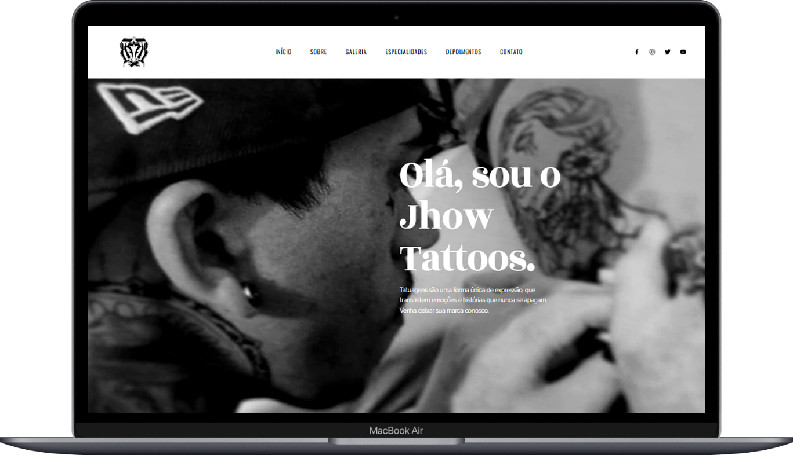

  <h1>✨ Projeto Concluído com Sucesso! 🎉</h1>

 

  
  <h3>@Dev Jhow.Tatoos</h3>
  

    <a href="https://studioinkzone.netlify.app" target="_blank" rel="noreferrer">Demo do projeto</a>
  

<!-- Sobre o Projeto -->
<section>
  <h2>Sobre o Projeto</h2>
   
  

    
      
    
  

   

  
<strong>Sobre o aplicativo:</strong>

  <ul>
    <li>Modelo de uma landing-page para Estúdio de Tatuagem</li>
    <li>Cliente pode mandar mensagem para o estúdio</li>
  </ul>

  
<a href="#topo">Para o topo</a>

</section>

<!-- Tecnologias -->
<section>
  <h3>Desenvolvido com:</h3>
  <ul>
    <li><a href="https://reactjs.org/" target="_blank" rel="noreferrer">
      
      React
    </a></li>
    <li>TailwindCSS</li>
    <li>React Image Gallery</li>
    <li>EmailJS</li>
    <li>Toast</li>
    <li>React-Photo-Album</li>
    <li>React Google Maps</li>
    <li>React-Modal-Video</li>
    <li>Swiper</li>
    <li>Framer-Motion</li>
  </ul>
</section>

<!-- Iniciar -->
<section>
  <h2>Iniciar</h2>
  <ol>
    <li>Clonar o repositório:
      <pre><code>git clone https://github.com/xjhowx-upgrates/Site-00-Jhow-Tattoos.git</code></pre>
    </li>
    <li>Abra a pasta:
      <pre><code>cd StudioTattoo</code></pre>
    </li>
    <li>Instale as dependências:
      <pre><code>npm install</code></pre>
    </li>
    <li>Inicie o projeto:
      <pre><code>npm run dev</code></pre>
    </li>
  </ol>
  
<a href="#topo">Para o topo</a>

</section>

<!-- Contato -->
<section>
  <h2>Conecte-se Comigo!</h2>
  

    
    
    
    
    
  

  
<a href="#topo">Para o topo</a>

</section>
